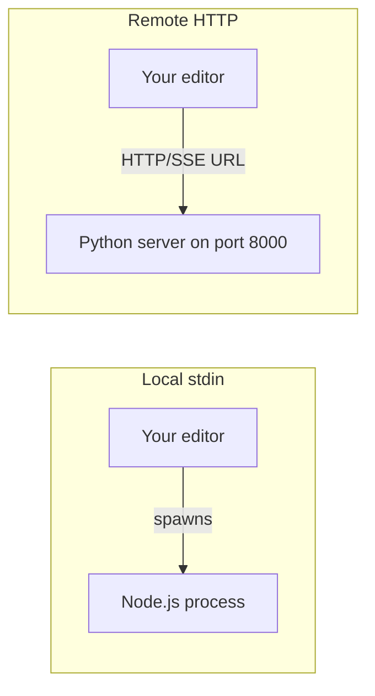

# Coding standards MCP server (HTTP)

A remote MCP server that exposes your team's coding standards as tools over HTTP/SSE. Use this when you want a shared server that multiple editors or users can connect to, or when you prefer Python over Node.js.

## Connection flow



When to use stdin vs HTTP: Use the [mcp-stdin-server](../mcp-stdin-server/) for the simplest setup — your editor spawns the Node process. Use this HTTP server when you want a shared remote server or prefer Python.

## Prerequisites

- Python 3.10 or higher

Check your version:

```bash
python --version
# or
python3 --version
```

## Python environment guide (for junior developers) a virtual environment — it isolates this project's dependencies from your system Python and avoids conflicts with other projects.

### Step 1: Create a virtual environment

Windows (PowerShell):

```powershell
cd exercise-03-build-your-own-tooling/mcp-server/mcp-http-server
python -m venv venv
.\venv\Scripts\Activate.ps1
```

Mac / Linux:

```bash
cd exercise-03-build-your-own-tooling/mcp-server/mcp-http-server
python3 -m venv venv
source venv/bin/activate
```

When activated, your prompt will show `(venv)`.

### Step 2: Install dependencies (inside the virtual environment)

With the venv activated, install the MCP package:

```bash
pip install -r requirements.txt
```

### Step 3: Run the server

```bash
python server.py
```

You should see output like:

```
INFO:     Started server process
INFO:     Uvicorn running on http://0.0.0.0:8000
```

### Step 4: Verify it works

- Open a browser to `http://localhost:8000` — you may see a simple response or 404 (the MCP endpoint is at `/mcp`).
- Or use the [MCP Inspector](https://github.com/modelcontextprotocol/inspector): `npx -y @modelcontextprotocol/inspector` and connect to `http://localhost:8000/sse`.

### Step 5: Stop the server

Press `Ctrl+C` in the terminal.

## Troubleshooting | Solution |
|---------|----------|
| `python: command not found` | Use `python3` instead of `python`, or install Python from [python.org](https://www.python.org/downloads/). |
| `ModuleNotFoundError: No module named 'mcp'` | Run `pip install -r requirements.txt` from the `mcp-http-server/` folder. |
| `Address already in use` | Port 8000 is in use. Stop the other process or change the port in `server.py` (e.g. `port=8001`). |
| `Permission denied` | On Linux/Mac, try `python3 -m venv venv` and ensure you have write access to the folder. |

## Connecting your editor support HTTP/SSE MCP can connect to the server URL. Start the server first, then add it to your editor config.

Example (Cursor / VS Code):

```json
{
  "coding-standards": {
    "url": "http://localhost:8000/sse"
  }
}
```

The exact config format depends on your editor. See `../mcp-exercises/SETUP.md` for editor-specific instructions.

## Available tools server:

| Tool | Description |
|------|-------------|
| `list_categories` | Lists all supported languages and their categories. Call first for discovery. |
| `get_guidelines` | Returns the full standards document for a language and category. |
| `search_guidelines` | Full-text search across all standards for a language. |
| `get_quick_reference` | Returns the top-10 most important rules for a language. |

## Customising standards

Edit the markdown files in `../standards/{language}/` directly. Both the mcp-stdin-server and mcp-http-server read from the same folder. No rebuild needed — changes take effect on the next request.
